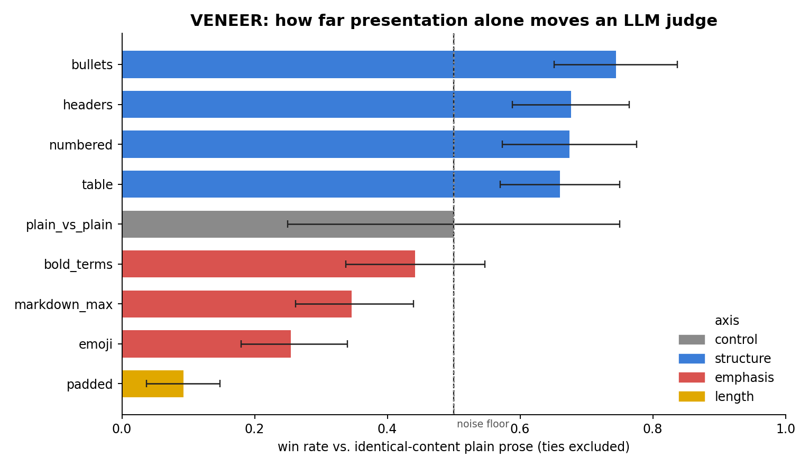
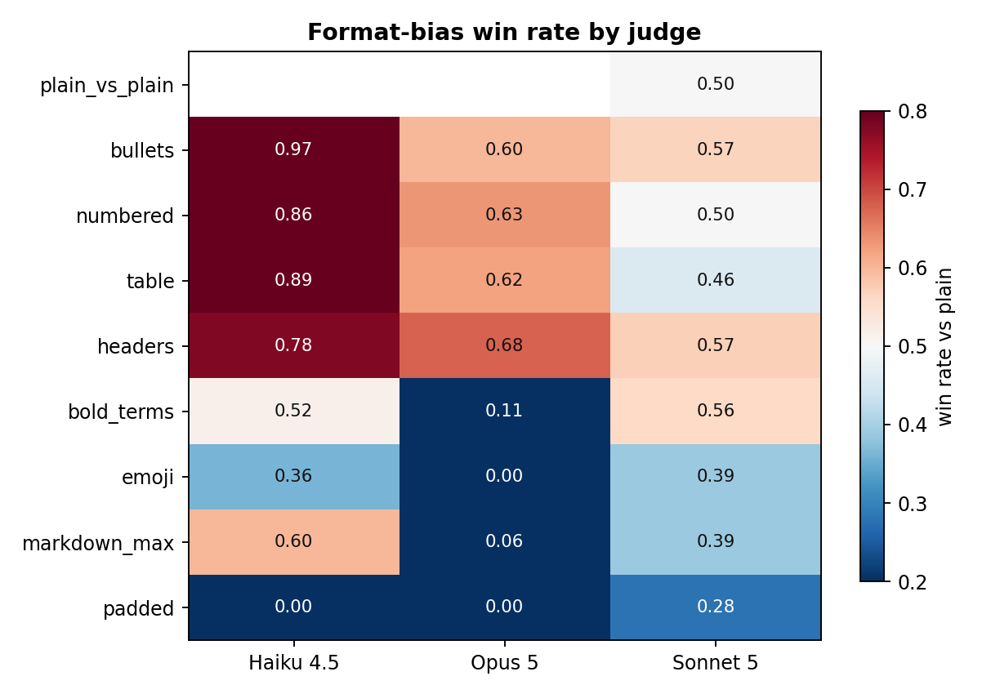

# VENEER — a format-bias benchmark for LLM judges

**Same facts. Different clothes. Watch the judge change its mind.**

VENEER measures how much of an LLM judge's verdict is bought by *presentation*
rather than *substance*.

Every answer in this dataset is rendered from one fixed list of atomic claims.
Nine renderers turn that same claim list into plain prose, bullets, a numbered
list, generic markdown headings, a table, bolded key terms, maximal markdown,
emoji bullets, and a padded version. **No renderer adds, removes or alters a
claim** — a machine check in the harness compares the word multiset of every
rendering against its source claims and fails on any leak (it caught a real bug
during construction). So when a judge prefers one rendering over another, that
preference cannot be about content.

## Headline result: a **65-point swing on identical content**

The same claims win **74.4%** of the time dressed as `bullets` and only
**9.3%** dressed as `padded`. Nothing about the substance changed.

The direction is the interesting part, and it is not "more formatting is better":

- **Structure helps.** Bullets, numbered lists, generic headings and tables
  average **68.9%** against plain prose. All four clear indifference.
- **Bulk is punished hardest.** `padded` — the same claims wrapped in neutral
  hedging, not one new fact — wins just **9.3%**.
- **Decoration is mixed, and that is the sharper finding.** Emoji and maximal
  markdown lose overall, but `bold_terms` is the one condition whose confidence
  interval still contains 50% — so "decoration hurts" is not a safe blanket
  claim.

**The judges disagree in sign.** On `markdown_max`, Haiku 4.5 scores
0.600 and Opus 5 scores
0.056 — the *same answer* wins or loses depending
on which judge you asked, on formatting alone. Pooling across judges hides this;
the per-judge table below does not.

**The control matters most.** Plain prose judged against a byte-identical copy of
itself ties **85%** of the time — the judges correctly see no difference
and decline to choose. Against a reformatted version of the *same claims* the tie
rate collapses to **9%**: they become decisive about a difference that
does not exist in the content.

**972 pairwise judgments** · 36 items ·
6 domains · 3 judges · 7 of 8 format
conditions differ from indifference at 95% confidence.



## The leaderboard metric

**VENEER score** = mean absolute deviation from a 50% win rate across all format
conditions, in percentage points. It is how much of a verdict presentation alone
can buy. **0 = perfectly format-blind.** Lower is better — but only for a
judge that is not position-confounded (next paragraph).

**A VENEER score is only interpretable next to the judge's position bias**, so
the two are always reported together. A judge whose verdict is decided by *where*
an answer sits produces a win rate pulled toward 50% in every condition — which
looks identical to genuine format-blindness.

| judge | VENEER score ↓ | moved most by | its win rate | picks 1st-shown | position gap | confounded |
|---|---|---|---|---|---|---|
| Sonnet 5 | **8.55** | `padded` | 27.8% | 13% | +0.73 | **yes** |
| Haiku 4.5 | **28.18** | `padded` | 0.0% | 64% | -0.28 | no |
| Opus 5 | **29.61** | `emoji` | 0.0% | 44% | +0.17 | no |

**Read that table carefully — the lowest score is not the best judge.**
Sonnet 5 scores 8.55, but it picks the
first-shown answer only 13% of the time: its
variant wins **87%** of the time when the
variant is shown second and collapses when shown first (gap
+0.73). Randomising order correctly cancels that in the
pooled number, which is exactly why its VENEER score looks flat. **That is
position dominance, not format robustness**, and this benchmark flags it rather
than crowning it.

By the same table, **Opus 5** (29.61, position
gap +0.17) gives the *cleanest* read of a real format
effect: its verdicts are the least contaminated by position, so its large VENEER
score is measuring formatting and not seating.



## Repo layout

| file | rows | what |
|---|---|---|
| `items.csv` | 36 | question + the atomic claim list that is the entire substance |
| `renderings.csv` | 324 | every claim list rendered 9 ways |
| `judgments.csv` | 972 | one pairwise verdict per row, with presentation order |
| `summary.csv` | 9 | win rate, tie rate and bootstrap CI per rendering |
| `leaderboard.csv` | 3 | VENEER score per judge |

## Design notes that matter

- **Pairwise, not absolute.** Absolute 1–10 judge scores saturate. Every variant
  is compared against the `plain` rendering of the *same* item.
- **Order is randomised** per (item, rendering, judge) by a fixed seed, so
  position bias cancels in aggregate and is separately reported.
- **The control is the point.** `plain_vs_plain` pits the baseline against a
  byte-identical copy. It ties 85% of the time, and its forced choices
  split exactly 50/50 — which is what a working judge should do. Because that
  leaves a small non-tie sample, significance is tested against indifference
  (0.50) rather than against the control's own wide interval.
- **Scaffolding is content-free by construction.** Section headings are generic
  ("Overview", "Key Details"), table columns are "Point"/"Detail", padding is
  neutral hedging. None of it carries information.
- **Position bias is real and separately reported.** Haiku 4.5 picks the first-shown answer 64% of the time, Opus 5 picks the first-shown answer 44% of the time, Sonnet 5 picks the first-shown answer 18% of the time. Randomising presentation
  order per (item, rendering, judge) is therefore load-bearing, not decorative —
  an unrandomised sweep would have measured position, not format.

## Limitations (read these before citing it)

- **The `plain` baseline is arguably a degenerate presentation, not a neutral
  one.** Claims are generated as atomic, standalone, connective-free sentences,
  and `plain` joins them with spaces — so the baseline reads as a wall of
  disconnected assertions. Content that is list-shaped by construction plausibly
  flatters list renderings. Two things limit the damage: `padded` is prose-vs-
  prose and immune to it, and the headline swing is anchored between two
  *variants* rather than against the baseline. Still, "bullets beat prose" is the
  weakest claim here and a connective-rich prose baseline is the top of the
  to-do list.
- **One model family.** All {len(head['judges'])} judges are Anthropic models, so
  cross-family generalisation is untested. This is the single most valuable
  contribution an outside user can make.
- **{head['n_items']} items, 6 domains.** Enough to separate these effect sizes,
  not enough for fine-grained per-domain claims.
- **Judges score with one generic rubric.** A rubric that explicitly says
  "ignore formatting" may well shrink the effect — testing that is the obvious
  next experiment, and the harness supports it by editing one prompt.
- **Position bias is large in this judge pool** and is reported per judge for
  exactly that reason. Any future submission without a position-gap column
  should be treated as uninterpretable.

## Reproduce / extend

```bash
git clone https://github.com/uditjainstjis/veneer-bench && cd veneer-bench
python3 src/render.py data/items.json     # rebuild + verify substance invariance
python3 src/run_judges.py                 # run the sweep (resumable)
python3 src/analyze.py                    # tables, leaderboard, figures
```

Adding a judge is one line in `JUDGES` in `src/run_judges.py`. Adding a format
axis is one pure function in `src/render.py` — if it leaks content, the checker
fails it.

## Why this exists

LLM-as-judge is now load-bearing in RLHF preference data, eval harnesses, agent
self-critique and model-selection decisions. If a judge's verdict moves this far
on presentation alone, then any pipeline that ranks *model outputs* with an LLM
judge is partly ranking *house style* — and models trained on that signal learn
to format, not to be right.

License: CC BY 4.0 (data) / MIT (code). Contributions welcome — especially judges
from other model families.
